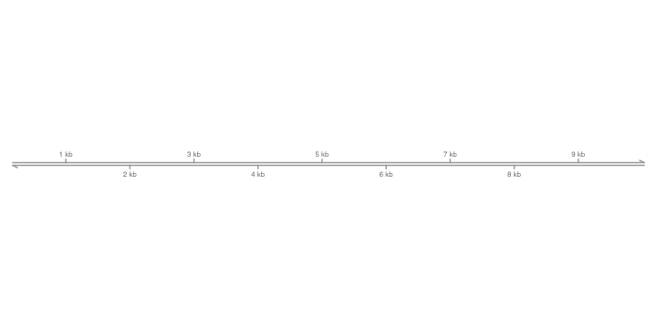

Visualising Genomics Data
========================================================
author: MRC Clinical Sciences Centre
date: http://mrccsc.github.io/training.html
autosize: true
author: "MRC CSC Bioinformatics Core Team"
date:http://mrccsc.github.io/training.html
width: 1440
height: 1100
autosize: true
font-import: <link href='http://fonts.googleapis.com/css?family=Slabo+27px' rel='stylesheet' type='text/css'>
font-family: 'Slabo 27px', serif;
css:style.css

Intro slides
========================================================


Topics Covered
========================================================


* Visualising features in Gviz
  + Introduction to Gviz.
  + Plotting coverage over regions.
  + Adding annotation.
  + Plotting reads
  + Plotting splice junctions.
* Visualising high dimensional data
  + Heatmap
  + Principal Component Analysis
* Meta signal of Genomic Intervals/Regions
  + Replicate peaks
  + Average Coverage
  + Motif occurence
* Exporting data to IGV
  + Tracktables
  + Exporting DESeq2 results to IGV

Visualising Genomics Data around Genomic Features
========================================================

Genomics data can often be visualised in genome browsers such as the fantastic IGV genome browser.

This allows for the visualisation our processed data in a specific genomic context.

In genomics it is important to review our data/results and hypotheses in a browser to identify pattern or potential artefacts missed within our analysis.

Visualising Genomics Data around Genomic Features in IGV
========================================================

We have already touched alittle on using the IGV browser to review our data and get access to online data repositories.

IGV is quick, user friendly GUI to perform the essential task of genomics data review.

For more information see our course on IGV [here](http://mrccsc.github.io/IGV_course/).


Visualising Genomics Data around Genomic Features in R
========================================================

Using the genome browser to review sites of interest across the genome is a critical first step.

Using indexed files, IGV offers an method to rapidly interrogate genomics data along the linear genome.

However, as with any GUI, IGV does not offer the flexibility in displaying data we wish to achieve and to review large number of sites demands significant user input or creation of IGV batch scripts.

Visualising Genomics Data around Genomic Features in R (Gviz)
========================================================

The Gviz packages offers methods to produce publication quality plots of genomics data at genomic features of interest.


Lets get started looking at using Gviz in some Biological example.
First we need to install the package.


```r
## try http:// if https:// URLs are not supported
source("https://bioconductor.org/biocLite.R")
biocLite("Gviz")
```


Getting started with Gviz -- Linear genome axis.
========================================================

Gviz provides methods to plot many genomics data types (as with IGV) over genomic features and genomic annotation within a linear genomic reference.


The first thing we can do therefor is set up our linear axis representing positions on genomes.

For this we use our first method from Gviz **GenomeAxisTrack()**.
Here we use the **name** parameter set the name to be "myAxis".


```r
library(Gviz)
genomeAxis <- GenomeAxisTrack(name="MyAxis")
genomeAxis
```

```
Genome axis 'MyAxis'
```

Getting started with Gviz -- Plotting the axis
========================================================

Now we have created a **GenomeAxisTrack** track object we will wish to display the object using **plotTracks** function.

In order to display a axis track we need to set the limits of the plot *(otherwise where would it start and end?)*.


```r
plotTracks(genomeAxis,from=100,to=10100)
```




Getting started with Gviz -- Configuring the axis (part-1)
========================================================

It is fairly straightforward to create and render this axis.
Gviz offers a high degree of flexibility in the way these tracks can be plotted with some very useful plotting configurations included.

A useful feature is to add some information on the direction of the linear genome represented in this GenomeAxisTrack.

We can add labels for the 5' to 3' direction for the positive and negative strand by using the **add53** and **add35** parameters.


```r
plotTracks(genomeAxis,from=100,to=10100,
           add53=T,add35=T)
```


Getting started with Gviz -- Configuring the axis (part-2)
========================================================

We can also configure the resolution of the axis (albeit rather bluntly) using the **littleTicks** parameter.

This will add additional axis tick marks between those shown by default.


```r
plotTracks(genomeAxis,from=100,to=10100,
           littleTicks = TRUE)
```


Getting started with Gviz -- Configuring the axis (part-3)
========================================================

By default the plot labels for the genome axis track are alternating below and above the line.

We can further configure the axis labels using the **labelPos** parameter.

Here we set the labelPos to be always below the axis


```r
plotTracks(genomeAxis,from=100,to=10100,
           labelPos="below")
```


Getting started with Gviz -- Configuring the axis (part-4)
========================================================

In the previous plots we have producing a genomic axis which allows us to consider the position of the features in the linear genome.

In some contexts we may be more interested in relative distances around and between the genomic features being displayed.

We can then configure the axis track to give us a relative representative of distance.


```r
plotTracks(genomeAxis,from=100,to=10100,
           scale=0.5)
```


