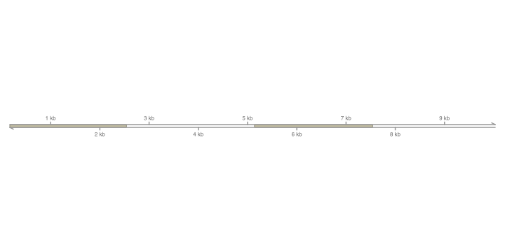
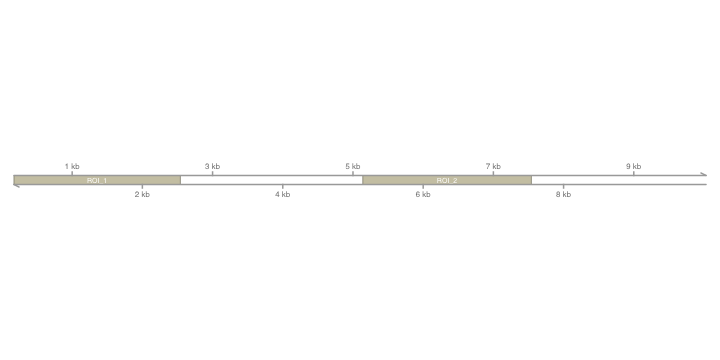
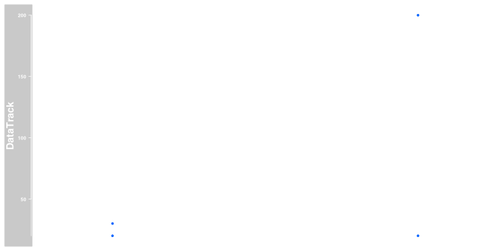
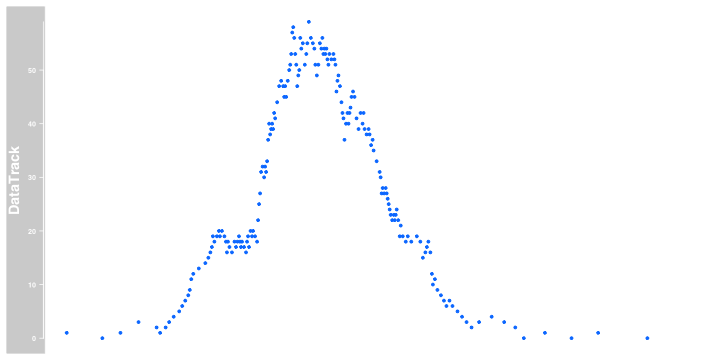
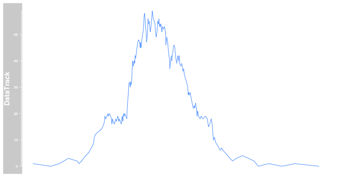
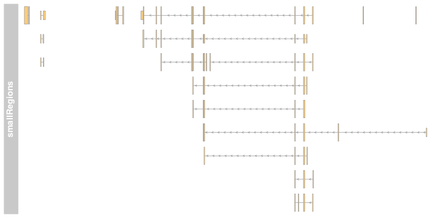
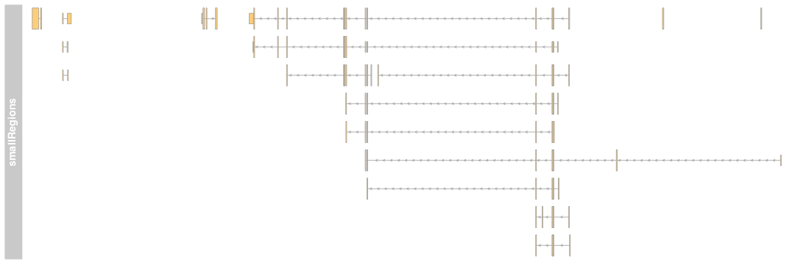
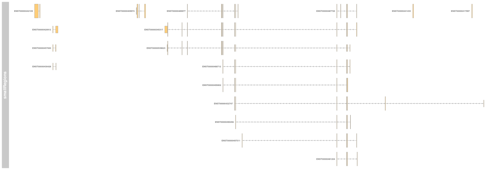
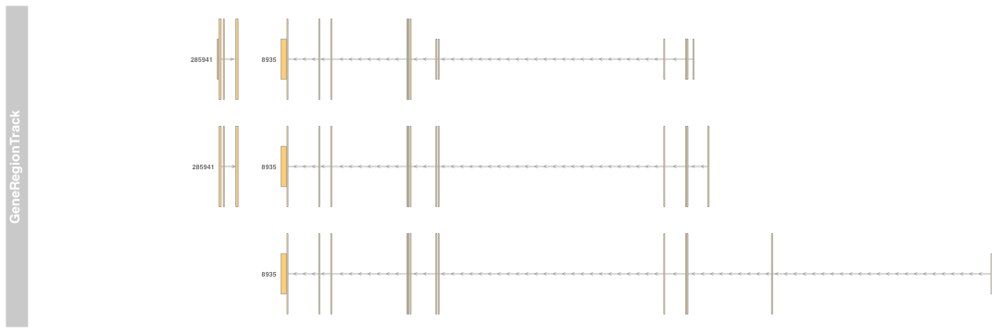
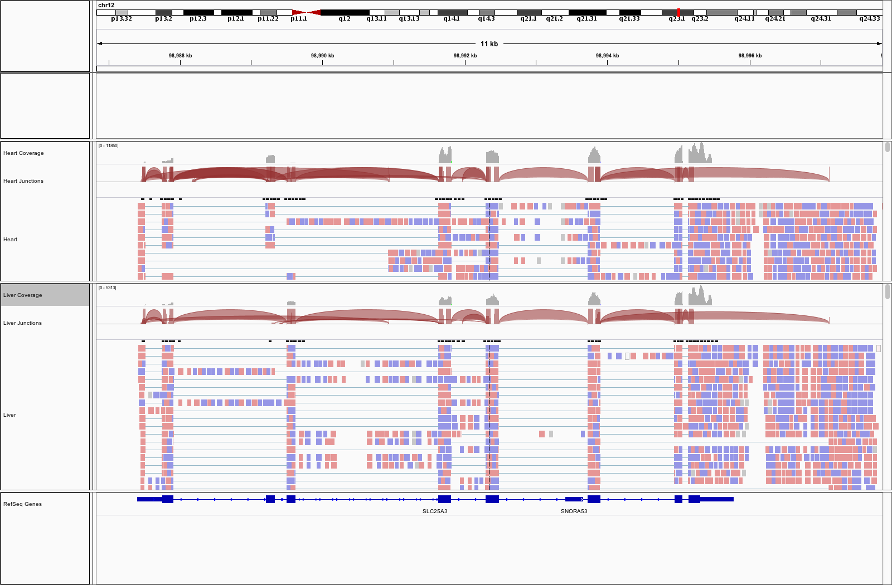

Visualising Genomics Data
========================================================
author: MRC Clinical Sciences Centre
date: http://mrccsc.github.io/training.html
autosize: true
author: "MRC CSC Bioinformatics Core Team"
date:http://mrccsc.github.io/training.html
width: 1440
height: 1100
autosize: true
font-import: <link href='http://fonts.googleapis.com/css?family=Slabo+27px' rel='stylesheet' type='text/css'>
font-family: 'Slabo 27px', serif;
css:style.css

Intro slides
========================================================


Topics Covered
========================================================


* Visualising features in Gviz
  + Introduction to Gviz.
  + Plotting coverage over regions.
  + Adding annotation.
  + Plotting reads
  + Plotting splice junctions.

Visualising Genomics Data around Genomic Features
========================================================

Genomics data can often be visualised in genome browsers such as the fantastic IGV genome browser.

This allows for the visualisation our processed data in a specific genomic context.

In genomics it is important to review our data/results and hypotheses in a browser to identify pattern or potential artefacts missed within our analysis.

Visualising Genomics Data around Genomic Features in IGV
========================================================

We have already touched alittle on using the IGV browser to review our data and get access to online data repositories.

IGV is quick, user friendly GUI to perform the essential task of genomics data review.

For more information see our course on IGV [here](http://mrccsc.github.io/IGV_course/).


Visualising Genomics Data around Genomic Features in R
========================================================

Using the genome browser to review sites of interest across the genome is a critical first step.

Using indexed files, IGV offers an method to rapidly interrogate genomics data along the linear genome.

However, as with any GUI, IGV does not offer the flexibility in displaying data we wish to achieve and to review large number of sites demands significant user input or creation of IGV batch scripts.

Visualising Genomics Data around Genomic Features in R (Gviz)
========================================================

The Gviz packages offers methods to produce publication quality plots of genomics data at genomic features of interest.


Lets get started looking at using Gviz in some Biological example.
First we need to install the package.


```r
## try http:// if https:// URLs are not supported
source("https://bioconductor.org/biocLite.R")
biocLite("Gviz")
```


Getting started with Gviz -- Linear genome axis.
========================================================

Gviz provides methods to plot many genomics data types (as with IGV) over genomic features and genomic annotation within a linear genomic reference.


The first thing we can do therefor is set up our linear axis representing positions on genomes.

For this we use our first method from Gviz **GenomeAxisTrack()**.
Here we use the **name** parameter set the name to be "myAxis".


```r
library(Gviz)
genomeAxis <- GenomeAxisTrack(name="MyAxis")
genomeAxis
```

```
Genome axis 'MyAxis'
```

Getting started with Gviz -- Plotting the axis
========================================================

Now we have created a **GenomeAxisTrack** track object we will wish to display the object using **plotTracks** function.

In order to display a axis track we need to set the limits of the plot *(otherwise where would it start and end?)*.


```r
plotTracks(genomeAxis,from=100,to=10100)
```


Getting started with Gviz -- Configuring the axis (part-1)
========================================================

It is fairly straightforward to create and render this axis.
Gviz offers a high degree of flexibility in the way these tracks can be plotted with some very useful plotting configurations included.

A useful feature is to add some information on the direction of the linear genome represented in this GenomeAxisTrack.

We can add labels for the 5' to 3' direction for the positive and negative strand by using the **add53** and **add35** parameters.


```r
plotTracks(genomeAxis,from=100,to=10100,
           add53=T,add35=T)
```


Getting started with Gviz -- Configuring the axis (part-2)
========================================================

We can also configure the resolution of the axis (albeit rather bluntly) using the **littleTicks** parameter.

This will add additional axis tick marks between those shown by default.


```r
plotTracks(genomeAxis,from=100,to=10100,
           littleTicks = TRUE)
```


Getting started with Gviz -- Configuring the axis (part-3)
========================================================

By default the plot labels for the genome axis track are alternating below and above the line.

We can further configure the axis labels using the **labelPos** parameter.

Here we set the labelPos to be always below the axis


```r
plotTracks(genomeAxis,from=100,to=10100,
           labelPos="below")
```


Getting started with Gviz -- Configuring the axis (part-4)
========================================================

In the previous plots we have producing a genomic axis which allows us to consider the position of the features in the linear genome.

In some contexts we may be more interested in relative distances around and between the genomic features being displayed.

We can then configure the axis track to give us a relative representative of distance using the **scale** parameter


```r
plotTracks(genomeAxis,from=100,to=10100,
           scale=1,labelPos="below")
```


Getting started with Gviz -- Configuring the axis (part-4b)
========================================================

We may want to add only a part of the scale (such as with Google Maps) to allow the reviewer to get a sense of distance.

We can specify how much of the total axis we wish to display as a scale using a value of 0 to 1 representing the proportion of scale to show.


```r
plotTracks(genomeAxis,from=100,to=10100,
           scale=0.3)
```


Getting started with Gviz -- Configuring the axis (part-4c)
========================================================

We can also provide numbers greater than 1 to the **scale** parameter which will determine, in absolute base pairs, the size of scale to display.


```r
plotTracks(genomeAxis,from=100,to=10100,
           scale=2500)
```


Getting started with Gviz -- Axis and Regions of Interest (part-1)
========================================================

Previously we have seen how to highlight regions of interest in the scale bar for IGV.

These "regions of interest" may be user defined locations which add context to the scale and the genomics data to be displayed (e.g. Domain boundaries such as topilogically associated domains)


Getting started with Gviz -- Axis and Regions of Interest (part-2)
========================================================

We can add "regions of interest" to the axis plotted by Gviz as we have done with IGV.

To do this we will need to define some ranges to signify the positions of "regions of interest" in the linear context of our genome track.

Since the plots have no apparent context for chromosomes (yet), we will use a IRanges object to specify "regions of interest" as opposed to the genome focused GRanges.

You can see our material [here](http://mrccsc.github.io/Bioconductor/) on Bioconductor objects for more information on IRanges and GRanges.

Brief recap (Creating an IRanges)
========================================================

To create an IRanges object we will load the IRanges library and specify vectors of **start** and **end** parameters to the **IRanges** constructor function.


```r
library(IRanges)
regionsOfInterest <- IRanges(start=c(140,5140),end=c(2540,7540))
names(regionsOfInterest) <- c("ROI_1","ROI_2")
regionsOfInterest
```

```
IRanges object with 2 ranges and 0 metadata columns:
            start       end     width
        <integer> <integer> <integer>
  ROI_1       140      2540      2401
  ROI_2      5140      7540      2401
```

Getting started with Gviz -- Axis and Regions of Interest (part-3)
========================================================

Now we have our IRanges object representing our regions of interest we can include them in our axis.

We will have to recreate our axis track to allow us to include these regions of interest.

Once we have updated our GenomeAxisTrack object we can plot the axis with regions of interest included.


```r
genomeAxis <- GenomeAxisTrack(name="MyAxis",
                              range = regionsOfInterest)
plotTracks(genomeAxis,from=100,to=10100)
```


Getting started with Gviz -- Axis and Regions of Interest (part-4)
========================================================

We include the names specified in the IRanges for the regions of interest within the axis plot by specify the **showID** parameter to TRUE.


```r
plotTracks(genomeAxis,from=100,to=10100,
           range=regionsOfInterest,
           showId=T)
```




Plotting regions in Gviz - Data tracks
========================================================

Now we have some fine control of the axis, it follows that we want some to display some actual data along side our axis and/or regions of interest.

Gviz contains a general container for data tracks which can be created using the **DataTrack()** constructor function and associated object, **DataTrack**.

Generally DataTrack may be used to display all data types with some work but best fit ranges with associated signal as a matrix (multiple regions) or vector (single sample).

Lets update our IRanges object to  some score columns in the metadata columns. We can do this the **mcols** function as shown in our Bioconductor material.


```r
mcols(regionsOfInterest) <- data.frame(Sample1=c(30,20),Sample2=c(20,200))
regionsOfInterest <- GRanges(seqnames="chr5",ranges = regionsOfInterest)
```


Plotting regions in Gviz - Data tracks
========================================================

Now we have the data we need, we can create a simple **DataTrack** object.


```r
dataROI <- DataTrack(regionsOfInterest)
plotTracks(dataROI)
```


Plotting regions in Gviz - Data tracks
========================================================

As we have seen, Data tracks make use of GRanges which are the central workhorse of Bioconductors HTS tools.

This means we can take advantage of the many manipulations available in the Bioconductor tool set.

Lets use on of rtracklayer's importing tools to retrieve coverage from a bigWig as a GRanges object


```r
library(rtracklayer)
allChromosomeCoverage <- import.bw("Data/small_Sorted_SRR568129.bw",as="GRanges")
allChromosomeCoverage
```

```
GRanges object with 249 ranges and 1 metadata column:
        seqnames         ranges strand |     score
           <Rle>      <IRanges>  <Rle> | <numeric>
    [1]     chrM [1,     16571]      * |         0
    [2]     chr1 [1, 249250621]      * |         0
    [3]     chr2 [1, 243199373]      * |         0
    [4]     chr3 [1, 198022430]      * |         0
    [5]     chr4 [1, 191154276]      * |         0
    ...      ...            ...    ... .       ...
  [245]    chr20 [1,  63025520]      * |         0
  [246]    chr21 [1,  48129895]      * |         0
  [247]    chr22 [1,  51304566]      * |         0
  [248]     chrX [1, 155270560]      * |         0
  [249]     chrY [1,  59373566]      * |         0
  -------
  seqinfo: 25 sequences from an unspecified genome
```


Plotting regions in Gviz - Data tracks (part 4)
========================================================

Now we have our coverage as a GRanges object we can create our DataTrack object from this.

Notice we specify the chr


```r
accDT <- DataTrack(allChromosomeCoverage,chomosome="chr5")
accDT
```

```
DataTrack 'DataTrack'
| genome: NA
| active chromosome: chrM
| positions: 1
| samples:1
| strand: *
There are 248 additional annotation features on 24 further chromosomes
  chr1: 1
  chr10: 1
  chr11: 1
  chr12: 1
  chr13: 1
  ...
  chr7: 1
  chr8: 1
  chr9: 1
  chrX: 1
  chrY: 1
Call seqlevels(obj) to list all available chromosomes or seqinfo(obj) for more detailed output
Call chromosome(obj) <- 'chrId' to change the active chromosome 
```


Plotting regions in Gviz - Data tracks (part 5)
========================================================

To plot data now using the plotTracks() function we will specify the regions we wish to plot by specifying the chromsomes, start and end using the **chromosome**, **start** and **end** parameters.

By default we will get a similar point plot to seen before.


```r
plotTracks(accDT,
           from=134887451,to=134888111,
           chromosome="chr5")
```


Plotting regions in Gviz - Data tracks (part 6)
========================================================

By default we will get a similar point plot to seen before.

We can adjust the type of plots we want using the **type** argument.
Here as with standard plotting we can specify **"l"** to get a line plot.


```r
plotTracks(accDT,
           from=134887451,to=134888111,
           chromosome="chr5",type="l")
```




Plotting regions in Gviz - Data tracks (part 6)
========================================================

Many other types of plots are available for the DataTracks.

Including filled plots using "mountain".


```r
plotTracks(accDT,
           from=134887451,to=134888111,
           chromosome="chr5",type="mountain")
```


Plotting regions in Gviz - Data tracks (part 7)
========================================================

Histograms by specifying "h".


```r
plotTracks(accDT,
           from=134887451,to=134888111,
           chromosome="chr5",type="h")
```


Plotting regions in Gviz - Data tracks (part 8)
========================================================

Or smoothed plots using "smooth".


```r
plotTracks(accDT,
           from=134887451,to=134888111,
           chromosome="chr5",type="smooth")
```


Plotting regions in Gviz - Data tracks (part 9)
========================================================

and even a Heatmap using "heatmap".

Notice that Gviz will automatically produce the appropriate Heatmap scale.


```r
plotTracks(accDT,
           from=134887451,to=134888111,
           chromosome="chr5",type="heatmap")
```



Plotting regions in Gviz - Additional Parameters.
========================================================

As with all plotting functions in R, Gviz plots can be highly customisable.

Simple features such as point size and colour are easily set as for standard R plots using **sex** and **col** paramters.


```r
plotTracks(accDT,
           from=134887451,to=134888111,
           chromosome="chr5",
           col="red",cex=4)
```


Full description of the parameters


Putting track togethers - Axis and Data
========================================================

Now we have shown how to construct a data track and axis track we can put them together in one plot.

To do this we simply provide the GenomeAxisTrack and DataTrack objects as vector the **plotTracks()** function.


```r
plotTracks(c(accDT,genomeAxis),
           from=134887451,to=134888111,
           chromosome="chr5"
           )
```


Full description of the parameters

Putting track togethers - Ordering tracks in plot
========================================================

The order of tracks in the plot is simply defines by the order they are placed in the vector passed to **plotTracks()**


```r
plotTracks(c(genomeAxis,accDT),
           from=134887451,to=134888111,
           chromosome="chr5"
           )
```


Putting track togethers - Controling height of tracks in plot
========================================================

By default, Gviz will try and provide sensible track heights for your plots to best display your data.

The track height can be controlled by provided a vector of relative heights to the **sizes** paramter of the **plotTracks()** function.

If we want the axis to be 50% of the height of the Data track we specify the size for axis as 0.5 and that of data as 1.
The order of sizes must match the order of objects they relate to.


```r
plotTracks(c(genomeAxis,accDT),
           from=134887451,to=134888111,
           chromosome="chr5",
           sizes=c(0.5,1)
           )
```




Exercises
========================================================


Adding annotation to plots.
========================================================

Genomic annotation, such as Gene/Transcript models, play important part of visualisation of genomics data in context.

Gviz provides many routes for constructing Genomic Annotation using the AnnotationTrack() constructor function.

In contrast to the DataTracks AnnotationTracks allow specification for feature groups.

First lets create a GRanges object with some more regions


```r
toGroup <- GRanges(seqnames="chr5",
        IRanges(
          start=c(10,500,550,2000,2500),
          end=c(300,800,850,2300,2800)
        ))
names(toGroup) <- seq(1,5)

toGroup
```

```
GRanges object with 5 ranges and 0 metadata columns:
    seqnames       ranges strand
       <Rle>    <IRanges>  <Rle>
  1     chr5 [  10,  300]      *
  2     chr5 [ 500,  800]      *
  3     chr5 [ 550,  850]      *
  4     chr5 [2000, 2300]      *
  5     chr5 [2500, 2800]      *
  -------
  seqinfo: 1 sequence from an unspecified genome; no seqlengths
```

Adding annotation to plots. Grouping (part-1)
========================================================

Now we can create the AnnotationTrack object using the constructor.

Here we also provide a grouping to the **group** parameter in the AnnotationTrack function.


```r
annoT <- AnnotationTrack(toGroup,
                group = c("Ann1",
                          "Ann1",
                          "Ann2",
                          "Ann3",
                          "Ann3"))

plotTracks(annoT)
```


Adding annotation to plots.
========================================================

We can see we have got the samples grouped by lines.

But if we want to see the names we must specify the group parameter used using the **groupAnnotation** argument.


```r
plotTracks(annoT,groupAnnotation = "group")
```


Adding annotation to plots. Grouping (part-2)
========================================================

We can see we have got the samples grouped by lines.

But if we want to see the names we must specify the group parameter used using the **groupAnnotation** argument.


```r
plotTracks(annoT,groupAnnotation = "group")
```


Adding annotation to plots. Strands and direction.
========================================================

When we created the GRanges used here we did not specify any strand information.

```r
strand(toGroup)
```

```
factor-Rle of length 5 with 1 run
  Lengths: 5
  Values : *
Levels(3): + - *
```
When plotted annotation without strand is plotted as a box seen in previous slides

Adding annotation to plots. Strands and direction (part-2).
========================================================

Now we specify some strand information for the GRanges and replot.

Arrows now indicate the strand which the features are on.


```r
strand(toGroup) <- c("+","+","*","-","-")
annoT <- AnnotationTrack(toGroup,
                group = c("Ann1",
                          "Ann1",
                          "Ann2",
                          "Ann3",
                          "Ann3"))

plotTracks(annoT, groupingAnnotation="group")
```


Adding annotation to plots. Controlling the display density
========================================================

In the IGV course we saw how you could control the display density of certain tracks. 

Annotation tracks are often stored in files as the general feature format (see our previous course). 

IGV allows us to control the density of these tracks in the view options by setting to "collapsed", "expanded" or "squished".

Whereas "squished" and "expands" maintains much of the information within the tracks, "collapsed" collapases overlapping features in a single displayed feature.


Adding annotation to plots. Controlling the display density (part 2)
========================================================

In Gviz we have the same control over the display density of our annotation tracks.

By default the tracks are stacked using the "squish" option to make best use of the available space.


```r
plotTracks(annoT, groupingAnnotation="group",stacking="squish")
```


Adding annotation to plots. Controlling the display density (part 3)
========================================================


```r
plotTracks(annoT, groupingAnnotation="group",stacking="dense")
```


Adding annotation to plots. Feature types.
========================================================

AnnotationTracks may also hold information on feature types.

For GeneModels we may be use to feature types such as mRNA, rRNA, snoRNA etc.

Here in we can make use of feature types as well.

We can display any feature types within our data using the features() function. Here they are unset so displayed as unknown.


```r
feature(annoT)
```

```
[1] "unknown" "unknown" "unknown" "unknown" "unknown" "unknown"
```

Adding annotation to plots. Setting feature types.
========================================================

We can set our own feature types for the AnnotationTrack object using the same **feature()** function.

We can choose any feature types we wish to define.


```r
feature(annoT) <- c(rep("Good",4),rep("Bad",2))
feature(annoT)
```

```
[1] "Good" "Good" "Good" "Good" "Bad"  "Bad" 
```

Adding annotation to plots. Display feature types.
========================================================

Now we have defined our feature types we can use this information within our plots.

In GViz, we can directly specify the colours for the individual feature types within our AnnotationTrack.

Here we specify the "Good" features as blue and the "Bad" features as red.


```r
plotTracks(annoT, featureAnnotation = "feature",
           groupAnnotation = "group",
           Good="Blue",Bad="Red")
```


GeneRegionTrack
========================================================

We have seen how we can display complex annotation using the **AnnotationTrack** objects.

For gene models Gviz contains a more specialised object, the **GeneRegionTrack** object.

The **GeneRegionTrack** object contains additional parameters and display options most fitted for the display of gene models.

Lets start by looking at some of the small set of gene models stored in the Gviz package.


```r
data(geneModels)
head(geneModels)
```

```
  chromosome    start      end width strand feature            gene
1       chr7 26591441 26591829   389      + lincRNA ENSG00000233760
2       chr7 26591458 26591829   372      + lincRNA ENSG00000233760
3       chr7 26591515 26591829   315      + lincRNA ENSG00000233760
4       chr7 26594428 26594538   111      + lincRNA ENSG00000233760
5       chr7 26594428 26596819  2392      + lincRNA ENSG00000233760
6       chr7 26594641 26594733    93      + lincRNA ENSG00000233760
             exon      transcript     symbol
1 ENSE00001693369 ENST00000420912 AC004947.2
2 ENSE00001596777 ENST00000457000 AC004947.2
3 ENSE00001601658 ENST00000430426 AC004947.2
4 ENSE00001792454 ENST00000457000 AC004947.2
5 ENSE00001618328 ENST00000420912 AC004947.2
6 ENSE00001716169 ENST00000457000 AC004947.2
```

GeneRegionTrack
========================================================


```
  chromosome    start      end width strand feature            gene
1       chr7 26591441 26591829   389      + lincRNA ENSG00000233760
2       chr7 26591458 26591829   372      + lincRNA ENSG00000233760
3       chr7 26591515 26591829   315      + lincRNA ENSG00000233760
4       chr7 26594428 26594538   111      + lincRNA ENSG00000233760
5       chr7 26594428 26596819  2392      + lincRNA ENSG00000233760
6       chr7 26594641 26594733    93      + lincRNA ENSG00000233760
             exon      transcript     symbol
1 ENSE00001693369 ENST00000420912 AC004947.2
2 ENSE00001596777 ENST00000457000 AC004947.2
3 ENSE00001601658 ENST00000430426 AC004947.2
4 ENSE00001792454 ENST00000457000 AC004947.2
5 ENSE00001618328 ENST00000420912 AC004947.2
6 ENSE00001716169 ENST00000457000 AC004947.2
```

We can see that this data.frame contains information on start, end , chromosome and strand of feature needed to position features in a linear genome.

Also included are a featuretype column names "feature" and columns containing additional metadata to group by - "gene","exon","transcript","symbol".


GeneRegionTrack - Setting up the gene model track.
========================================================

We can define a GeneRegionTrack as we would all other tracktypes, here providing a genome name, chromosome of interest and a name for the track.


```r
grtrack <- GeneRegionTrack(geneModels, genome = "hg19",
                           chromosome = "chr7",
                           name = "smallRegions")
plotTracks(grtrack)
```


GeneRegionTrack - Setting up the gene model track.
========================================================


We can see that features here are rendered slightly differently to that of the AnnotationTrack.

Here direction is illustrated by arrows in Introns and unstranslated regions shown as narrower boxes.


GeneRegionTrack - Specialised labelling.
========================================================

Since gene models typically contain exons transcript and gene levels we can specify we wish to annotate our plots by these levels using the **transcriptAnnotation** and **exonAnnotation** parameters.

To label all transcripts by gene level annotation we specify the gene column to the **transcriptAnnotation** parameter.


GeneRegionTrack - Specialised labelling.
========================================================

Similarly we can label transcripts by transcript level.


GeneRegionTrack - Specialised labelling.
========================================================

Or we can label using the **transcriptAnnotation** object by any arbitary column where there is, at maximum, one level per transcript.


GeneRegionTrack - Specialised labelling of exons.
========================================================

As with transcripts we can label individual features using the **exonAnnotation** parameter by any arbitary column where there is one level per **exon**.


GeneRegionTrack - Specialized display density for gene models.
========================================================

We saw that we can control the display density with AnnotationTrack objects.

We can control the display density of GeneRegionTracks in a similar manner.



GeneRegionTrack - Specialized display density for gene models.
========================================================

However, since GeneRegionTrack is a special class of the Annotation object we have special parameter for dealing with display density of transcripts.

The **collapseTranscript** parameter allows us a finer degree of control than that seen with **stacking** parameter.

Here we set **collapseTranscript** to be true inorder to merge all overlapping transcripts. 


GeneRegionTrack - Specialized display density for gene models.
========================================================

Collapsing using the **collapseTranscripts** has summarised our transcripts into their respective gene boundaries.

We have lost information on the strand however. To retain this information we need to specify a new shape for our plots using the **shape** parameter. To capture direction we use the "arrow" shape


GeneRegionTrack - Specialized display density for gene models.
========================================================

The **collapseTranscripts** function also allows us some additional options by which to collapse our transcripts.

These methods maintain the intron information in the gene model and so get us closer to reproducing the "collapsed" feature in IGV.

Here we may collapse transcripts to the "longest".




GeneRegionTrack - Specialized display density for gene models.
========================================================

Or we may specify to **collapseTranscripts** function to collapse by "meta".

The "meta" option shows us a composite, lossless illustration of the gene models closer to that seen in "collapsed" IGV tracks.

Here all exon information is retained.


GeneRegionTrack - Building your own gene models.
========================================================

We have seen how gene models are organised in Bioconductor using the TxDB objects.

Gviz may be used in junction with TxDB objects to construct the GeneRegionTracks. 

We saw in the Bioconductor and ChIPseq course that many genomes have pre-build gene annotation within the respective TxDB libraries. Here we will load a TxDb for hg19 from the  **TxDb.Hsapiens.UCSC.hg19.knownGene** library.

```r
library(TxDb.Hsapiens.UCSC.hg19.knownGene)

txdb <- TxDb.Hsapiens.UCSC.hg19.knownGene
txdb
```

```
TxDb object:
# Db type: TxDb
# Supporting package: GenomicFeatures
# Data source: UCSC
# Genome: hg19
# Organism: Homo sapiens
# Taxonomy ID: 9606
# UCSC Table: knownGene
# Resource URL: http://genome.ucsc.edu/
# Type of Gene ID: Entrez Gene ID
# Full dataset: yes
# miRBase build ID: GRCh37
# transcript_nrow: 82960
# exon_nrow: 289969
# cds_nrow: 237533
# Db created by: GenomicFeatures package from Bioconductor
# Creation time: 2015-10-07 18:11:28 +0000 (Wed, 07 Oct 2015)
# GenomicFeatures version at creation time: 1.21.30
# RSQLite version at creation time: 1.0.0
# DBSCHEMAVERSION: 1.1
```

GeneRegionTrack - Building your own gene models from a TxDb.
========================================================

Now we have loaded our TxDb object and assigned it to *txdb*. We can use this TxDb object to construct our GeneRegionTrack. Here we focus on chromosome 7 again.


```r
customFromTxDb <- GeneRegionTrack(txdb,chromosome="chr7")
head(customFromTxDb)
```

```
GeneRegionTrack 'GeneRegionTrack'
| genome: hg19
| active chromosome: chr7
| annotation features: 6
```

GeneRegionTrack - Building your own gene models from a TxDb.
========================================================

With our new GeneRegionTrack we can now reproduce the gene models using the Bioconductor TxDb annotation.

Here the annotation is different but transcripts overlapping uc003syc are our SKAP2 gene.


```r
plotTracks(customFromTxDb,from=26591341,to=27034958,transcriptAnnotation="gene")
```



GeneRegionTrack - Building your own gene models from a TxDb.
========================================================

Now by combining the ability to create our own TxDb objects from GFFs we can create a very custom GeneRegionTrack from a GFF file.


```r
library(GenomicFeatures)
txdbFromGFF <- makeTxDbFromGFF(file = "~/Downloads/tophat2.gff")
customFromTxDb <- GeneRegionTrack(txdbFromGFF,chromosome="chr7")
plotTracks(customFromTxDb,from=26591341,to=27034958,transcriptAnnotation="gene")
```


Overplotting, thinbox feature.
========================================================

Exercises.
========================================================

SequenceTracks
========================================================

When displaying genomics data it can be important to illustrate the underlying sequence for the genome be viewed.

Gviz uses **SequenceTrack** objects to handle displaying sequencing information.

First we need to get some  sequence information for our genome of interest to display. Here we will use one of the BSgenome packages specific for hg19 - **BSgenome.Hsapiens.UCSC.hg19**. This contains the full sequence for hg19 as found in UCSC


```r
library(BSgenome.Hsapiens.UCSC.hg19)
BSgenome.Hsapiens.UCSC.hg19[["chr7"]]
```

```
  159138663-letter "DNAString" instance
seq: NNNNNNNNNNNNNNNNNNNNNNNNNNNNNNNNNN...NNNNNNNNNNNNNNNNNNNNNNNNNNNNNNNNN
```

SequenceTracks - From a BSgenome object
========================================================

We can create a **SequenceTrack** object straight from this BSgenome object using the **SequenceTrack()** constructor. 

We can then plot this **SequenceTrack** as with all track using the **plotTracks()** functions. Here we specify a *from*, *to* and *chromosome* to select a region to display.


```r
sTrack <- SequenceTrack(Hsapiens)
plotTracks(sTrack,from=134887024,to=134887074,
           chromosome = "chr7")
```


SequenceTracks - From a DNAstringset object
========================================================

I can also specify the DNAstringset object we have encountered in the Bioconductor and ChIP-seq courses.


```r
dsSet <- DNAStringSet(Hsapiens[["chr7"]])
names(dsSet) <- "chr7"
sTrack <- SequenceTrack(dsSet)
plotTracks(sTrack,from=134887024,to=134887074,
           chromosome = "chr7")
```


SequenceTracks - From a DNAstringset object
========================================================

Or even from a fasta file.

Here we use an example containing only the sequence around the region we are looking at to save space. Since the sequence is only of the region of interest we need specify the sequence limits for the *from* and *to* arguments.


```r
sTrack <- SequenceTrack("Data/chr7Short.fa")
plotTracks(sTrack,from=1,to=50,
           chromosome = "chr7")
```


SequenceTracks - Displaying complement sequence
========================================================

As with IGV, the sequence can be displayed as its complement. This is performed in Gviz by setting the **complement** argument to the **plotTracks()** function 


SequenceTracks - Displaying strand information
========================================================

We can also add 5' to 3' direction as we have with **GenomeAxisTrack** track objects using the **add53** parameter. This allows for a method to illustrate the strand of the sequence being diplayed.


SequenceTracks - Displaying strand information
========================================================

Notice the 5' and 3' labels have swapped automatically when we have specified the complement sequence.


SequenceTracks - Controlling base display size
========================================================

We can control the size of bases with the **cex** parameter, as with the standard R plotting. 

An interesting feature of this is that when bases may overlaps when plotted, Gviz will provide a colour representation of bases opposed to base characters themselves.


```r
plotTracks(sTrack,from=1,to=50,
           chromosome = "chr7")
```



```r
plotTracks(sTrack,from=1,to=50,
           chromosome = "chr7",
           cex=5)
```


AlignmentsTrack. 
========================================================

So far we have displayed summarised genomics data using GRanges objects or GRanges with associated metadata.

A prominent feature of Gviz is that it can work with Genomic Alignments, providing methods to generate graphical summaries on the fly.

Genomic Alignments are stored in Gviz within the AlignmentsTrack object.

Here we can read Genomic Alignments in from a BAM file, see our file formats course material, by specifying its location.


```r
   peakReads <- AlignmentsTrack("Data/small_Sorted_SRR568129.bam")
   peakReads
```

```
ReferenceAlignmentsTrack 'AlignmentsTrack'
| genome: NA
| active chromosome: chrNA
| referenced file: Data/small_Sorted_SRR568129.bam
| mapping: id=id, cigar=cigar, mapq=mapq, flag=flag, isize=isize, groupid=groupid, status=status, md=md, seq=seq
```

AlignmentsTrack.  Plotting Aligned Reads in Gviz
========================================================

The **AlignmentsTrack** object can be plotted in the same manner as other Gviz tracks using **plotTracks()** function.

Since the BAM file may contain information from all chromosomes we need to specify a chromsome to plot in the *chromosome* parameter and here we specify the *from* and *to* parameters too.


```r
   plotTracks(peakReads,
              chromosome="chr5",
              from=135312577,
              to=135314146)
```


AlignmentsTrack.  Plotting Aligned Reads in Gviz
========================================================


By default AlignmentTracks are rendered as the both the reads themselve and the calculated coverage from these reads.

Reads, as with AnnotationTrack objects, show the strand of the aligned read by the direction of the arrow.

AlignmentsTrack.  Plotting Aligned Reads in Gviz
========================================================

The type of plot/plots produced can be controlled by the *type* argument as we have done for **DataTrack** objects.

The valid types of plots for AlignmentsTrack objects are "pileup", "coverage" and "sashimi" (We've come across sashimi plots before). 

The type "pileup" displays just the reads.


AlignmentsTrack.  Plotting Aligned Reads in Gviz
========================================================

The type "coverage" displays just the coverage (depth of signal over genomic positions) calculated from the genomic alignments.


AlignmentsTrack.  Plotting Aligned Reads in Gviz
========================================================

As we have seen the default display is a combination of "pileup" and "coverage".

We can provide multiple *type* arguments to the **plotTracks()** function as a vector of valid types. The order in vector here does not affect the display order in panels.


AlignmentsTrack.  Plotting Aligned Reads in Gviz
========================================================

As we have seen the default display is a combination of "pileup" and "coverage".

We can provide multiple *type* arguments to the **plotTracks()** function as a vector of valid types. The order in vector here does not affect the display order in panels.


AlignmentsTrack.  Sashimi plots
========================================================

We have seen sashimi plots in IGV when reviewing RNA-seq data.

Sashimi plots display the strength of signal coming from reads spanning splice junctions and so can act to illustrate changes in exon usage between samples.

In IGV, we previous made use of the Bodymap data to show alternative splicing of an exon between heart and liver.



AlignmentsTrack.  Sashimi plots in Gviz
========================================================

To recapitulate this plot, we retrieved the subsection of Bodymap data as BAM files from the IGV tutorial datasets and brought it into the Data directory for the course.

First we must create two AlignmentsTrack objects, one for each tissue's BAM file of aligned reads. 

In this case since we are working with paired-end reads we must specify this by setting the *isPaired* parameter to TRUE


```
ReferenceAlignmentsTrack 'AlignmentsTrack'
| genome: NA
| active chromosome: chrNA
| referenced file: Data/liver.bodyMap.bam
| mapping: id=id, cigar=cigar, mapq=mapq, flag=flag, isize=isize, groupid=groupid, status=status, md=md, seq=seq
```

AlignmentsTrack.  Sashimi plots in Gviz
========================================================

As with **DataTrack** objects we can combine the AlignmentTracks as a vector for plotting with the **plotTracks()** function.

By default we will display the reads and calculated coverage. Here the paired reads and split reads are illustrated by thick and thin lines respectively


AlignmentsTrack.  Sashimi plots in Gviz
========================================================

To reproduce a plot similar to that in IGV we can simply include the "sashimi" type in the *type* parameter vector, here alongside "coverage" 


AlignmentsTrack.  Highlighting genomic alignment information.
========================================================

The **AlignmentTrack** object allows for specific parameters controlling how reads are displayed to be passed to the **plotTracks()** function.

Two useful functions are col.gaps and col.mates or lty.gap and lty.mates which will allow us to better disntiguish between gapped alignments (split reads) and gaps between read pairs respectively.


AlignmentsTrack.  Highlighting genomic alignment information.
========================================================

Similarly using lty.gap and lty.mate parameters. 

Line width may also be controlled with lwd.gap and lwd.mate parameters continuing the similarities to Base R plotting.


AlignmentsTrack.  Highlighting mismathces to reference.
========================================================

A common purpose in visualising alignment data in broswers is review information relating to mismatches to the genome which may be related to SNPs.

In order to highlight mismatches to the genome reference sequence we must first provide Gviz with some information on the reference sequence.

One method for this is to attach sequence information to the AlignmentsTrack itself providing a **SequenceTrack** object to **referenceSequence** parameter to the **AlignmentsTrack()** constructor. Here we can use the one we made earlier.


AlignmentsTrack.  Highlighting mismatches to reference.
========================================================

Now when we replot the pileup of reads mismatches in the reads are highlighted.


AlignmentsTrack.  Highlighting mismatches to reference.
========================================================

We could also specify the SequenceTrack just in the **plotTracks()** function as shown for the liver reads here. Here we simply include the relevant **SequenceTrack** object as a track to be plotted  alongside the BAM and Gviz connects the dots.


Data from GAlignments.


Exercises
===================


Bringing in External data.
========================================================

Gviz has functions to allow us to import data from external repositories and databases.

As in the IGV course, visualising genomics data in the context of additional genome information and external data held at these repositories provides a deeper insight into our own data.

In this course we will look at two main methods of querying external databases-

* The **UcscTrack** object and constructor
* The **BiomartGeneRegionTrack** object and constructor.

Bringing in External data. Gene models through Biomart
========================================================

We have previously seen how we can use the **biomaRt** Bioconductor package to programatically query various Biomarts (see our previous material).

Gviz allows us to both query Biomart and automatically create a GeneRegionTrack using the **BiomartGeneRegionTrack** objects and **BiomartGeneRegionTrack()** constructor.

Bringing in External data. Gene models through Biomart
========================================================

Here we construct a simple **BiomartGeneRegionTrack** object using the parameters to define locations of interest - "chromsome", "start","end","genome" as well as the Biomart to use, in this case Ensembl by setting the **name** parameter.


```r
bgrTrack <- BiomartGeneRegionTrack(genome="hg19",
                                   start=26591341,
                                   end=27034958,
                                   chromosome = "chr7",
                                   name="ENSEMBL")
```

Bringing in External data. Gene models through Biomart
========================================================

We can then plot the BiomartGeneRegionTrack as we have previous GeneRegionTracks.


```r
plotTracks(bgrTrack)
```


Bringing in External data. Gene models through Biomart
========================================================

Gviz allows the specification of filters to the **BiomartGeneRegionTrack()** constructor using the *filter* parameter.

Gviz use the **BiomaRt** Bioconductor package to query the Biomarts so we can apply the same filters as in BiomaRt, which we saw in our earlier material.


```
processing file: VizGenomicsData.Rpres
Loading required package: S4Vectors
Loading required package: stats4
Loading required package: BiocGenerics
Loading required package: parallel

Attaching package: 'BiocGenerics'

The following objects are masked from 'package:parallel':

    clusterApply, clusterApplyLB, clusterCall, clusterEvalQ,
    clusterExport, clusterMap, parApply, parCapply, parLapply,
    parLapplyLB, parRapply, parSapply, parSapplyLB

The following objects are masked from 'package:stats':

    IQR, mad, xtabs

The following objects are masked from 'package:base':

    anyDuplicated, append, as.data.frame, cbind, colnames,
    do.call, duplicated, eval, evalq, Filter, Find, get, grep,
    grepl, intersect, is.unsorted, lapply, lengths, Map, mapply,
    match, mget, order, paste, pmax, pmax.int, pmin, pmin.int,
    Position, rank, rbind, Reduce, rownames, sapply, setdiff,
    sort, table, tapply, union, unique, unsplit


Attaching package: 'S4Vectors'

The following objects are masked from 'package:base':

    colMeans, colSums, expand.grid, rowMeans, rowSums

Loading required package: IRanges
Loading required package: GenomicRanges
Loading required package: GenomeInfoDb
Loading required package: grid
Loading required package: GenomicFeatures
Loading required package: AnnotationDbi
Loading required package: Biobase
Welcome to Bioconductor

    Vignettes contain introductory material; view with
    'browseVignettes()'. To cite Bioconductor, see
    'citation("Biobase")', and for packages 'citation("pkgname")'.

Import genomic features from the file as a GRanges object ... OK
Prepare the 'metadata' data frame ... OK
Make the TxDb object ... OK
Loading required package: BSgenome
Loading required package: Biostrings
Loading required package: XVector
Quitting from lines 1303-1306 (VizGenomicsData.Rpres) 
Error: XML content does not seem to be XML: 
In addition: Warning messages:
1: package 'Gviz' was built under R version 3.3.1 
2: package 'S4Vectors' was built under R version 3.3.1 
3: package 'GenomeInfoDb' was built under R version 3.3.1 
4: package 'GenomicFeatures' was built under R version 3.3.1 
5: package 'AnnotationDbi' was built under R version 3.3.1 
6: package 'XVector' was built under R version 3.3.1 
Execution halted
```
